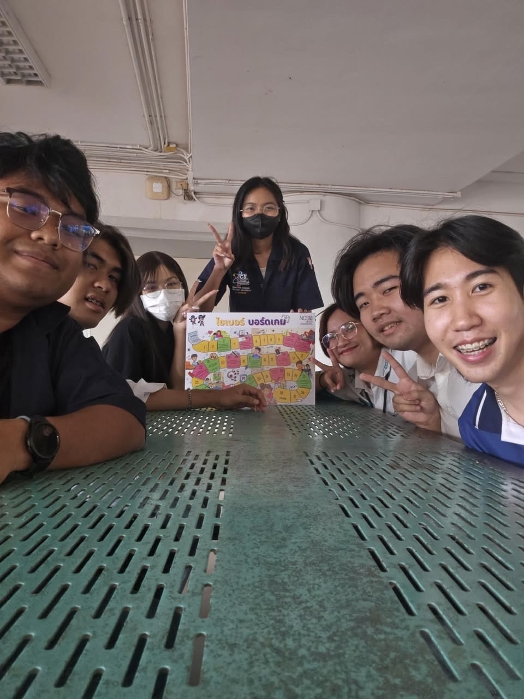
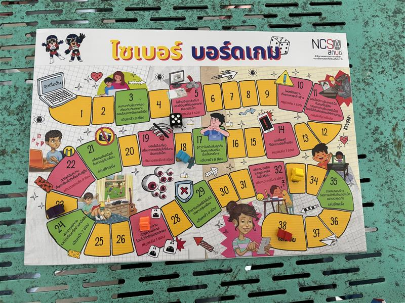

## Cyber Board Game (By National Cyber Security Agency : NCSA) Activity with God menu
---
### Securing the Human in information System Security

---

### Activity details
> เป็นการทำกิจกรรมของกลุ่มนิสิตคณะวิทยาศาสตร์ สาขาวิทยาการคอมพิวเตอร์ภายใต้ชื่อกลุ่ม "God menu" เพื่อต้องการให้ผู้คนตระหนักรู้ในเรื่องความปลอดภัยของไซเบอร์
> โดยได้นำ cyber board game ที่จัดทำโดย NCSA มาเป็นกิจกรรมที่ทำร่วมกับกลุ่มเป้าหมายในวันที่ 29 มกราคม 2568 เวลา 16:30 ณ ตึก 17 ศูนย์การเรียนรวมของมหาวิทยาลัยเกษตรศาสตร์ วิทยาเขตศรีราชา
> ซึ่งมีผู้เข้าร่วมในกิจกรรมครั้งนี้ทั้งสิ้น 7 คน
> * (ผู้เล่น) นิสิตชั้นปีที่ 4 คณะวิทยาศาสตร์ สาขาวิทยาการคอมพิวเตอร์ จำนวน 2 คน (กลุ่มเป้าหมาย)
> * (ผู้เล่น) นิสิตชั้นปีที่ 3 คณะวิทยาศาสตร์ สาชาวิทยาการคอมพิวเตอร์ จำนวน 3 คน (สมาชิกกลุ่ม God menu)
> * (ผู้คอยอธิบายกติกา)  นิสิตชั้นปีที่ 3 คณะวิทยาศาสตร์ สาชาวิทยาการคอมพิวเตอร์ จำนวน 1 คน (สมาชิกกลุ่ม God menu)
> * (ตากล้อง)  นิสิตชั้นปีที่ 3 คณะวิทยาศาสตร์ สาชาวิทยาการคอมพิวเตอร์ จำนวน 1 คน (สมาชิกกลุ่ม God menu)

---

#### Picture

---

#### Video
[Link](https://youtu.be/5kpjxZVgTWc)

---

#### หมายเหตุ
> ทางกลุ่ม God menu ได้ขออนุญาตผู้เกี่ยวข้องเพื่อขอบันทึกภาพและวิดีโอเป็นที่เรียบร้อยแล้ว

---

#### สมาชิกกลุ่ม
* [Kongsiri Panchuen]
* [Tippawan Ngobkratok](https://jis03.github.io/boardgame)
* [Tanapon Yurawan]
* [Watcharaphon Namaung]
* [Preeyada Kasetpibaln]
