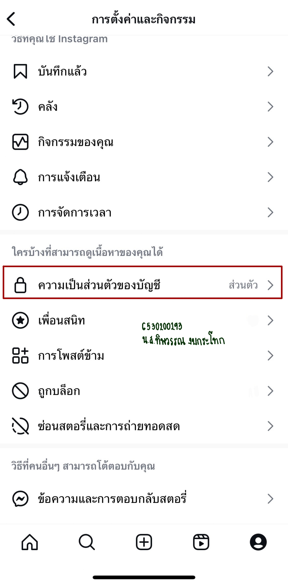

# Security Control

---

#### Examples of security control in everyday life
* การตั้งค่าความเป็นส่วนตัวในแอปพลิเคชัน Instagram

#### Location
* My telephone
  
#### Type of Security control
* Administrative Security Control
  
#### Control Functions
* Preventive (รูปแบบการป้องกันเหตุการณ์)

---

#### เหตุผลที่การตั้งรหัสผ่านโทรศัพท์เป็น Security control แบบ Administrative Security Control และ Control Functions เป็นแบบ Preventive
* การที่การตั้งรหัสผ่านโทรศัพท์เป็นแบบ Administrative Security Control เนื่องจากเป็นแนวทางปฏิบัติและนโยบายที่ช่วยควบคุมพฤติกรรมของผู้ใช้
* ที่เป็นแบบ Preventive เพราะการตั้งค่าความเป็นส่วนตัวในแอปพลิเคชัน Instagram เป็นการตั้งเพื่อป้องกันการเข้าถึงข้อมูลส่วนตัวโดยไม่ได้รับอนุญาต
