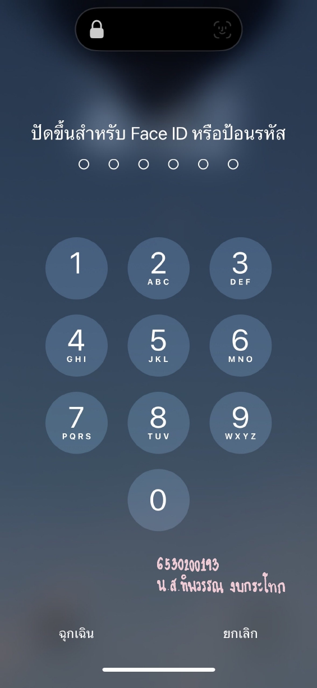

# Security Control

---

#### Examples of security control in everyday life
* การตั้งรหัสผ่านโทรศัพท์
#### Location
* My telephone
#### Type of Security control
* Technical Security Control
#### Control Functions
* Preventive (รูปแบบการป้องกันเหตุการณ์)

---

#### เหตุผลที่การตั้งรหัสผ่านโทรศัพท์เป็น Security control แบบ Technical Security Control และ Control Functions เป็นแบบ Preventive
> เนื่องจาก
