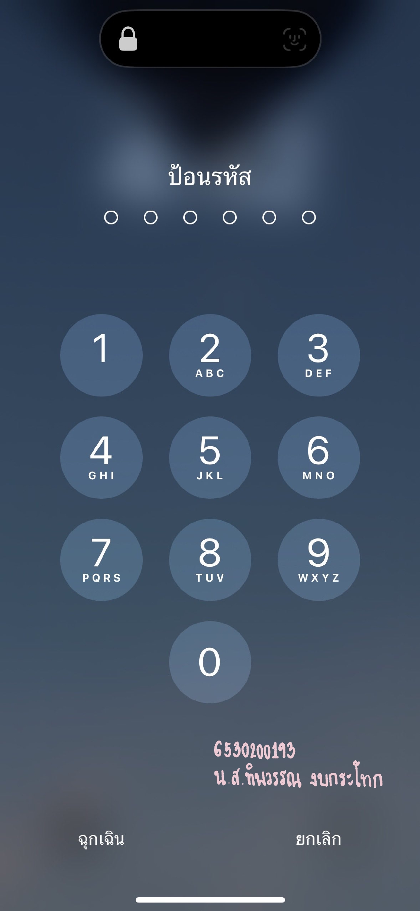

# Security Control

---

#### Examples of security control in everyday life
* การตั้งรหัสผ่านโทรศัพท์

#### Location
* My telephone
  
#### Type of Security control
* Technical Security Control
  
#### Control Functions
* Preventive (รูปแบบการป้องกันเหตุการณ์)

---

#### เหตุผลที่การตั้งรหัสผ่านโทรศัพท์เป็น Security control แบบ Technical Security Control และ Control Functions เป็นแบบ Preventive
* การที่การตั้งรหัสผ่านโทรศัพท์เป็นแบบ Technical Security Control เนื่องจากจะต้องใช้เทคโนโลยีเป็นเครื่องมือในการควบคุมและรักษาความปลอดภัย
* ที่เป็นแบบ Preventive เพราะการตั้งรหัสผ่านโทรศัพท์เป็นการสร้างมาเพื่อป้องกันการเข้าถึงอุปกรณ์โดยไม่ได้รับอนุญาต อีกทั้งเพื่อเป็นการยืนยันตัวตนของผู้ใช้ในการเข้าถึงข้อมูลในโทรศัพท์
